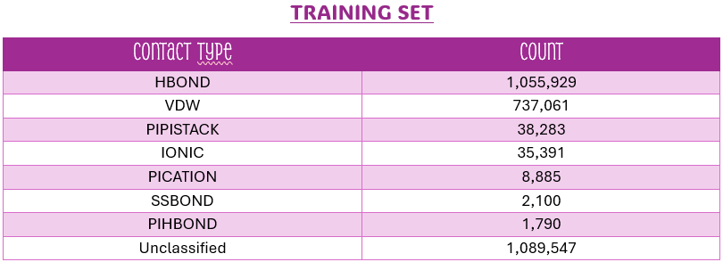

# Structural_Bioinfo_project: *"Classification of Contacts in Protein Structures with Machine Learning"*
Project developed for the Structural Bioinformatics course, A.Y. 2024–2025. University of Padua – Master's Degree in Data Science, Machine Learning for Intelligent Systems curriculum.

## 🧬 Project Description
Research project focused on developing machine learning models to replicate residue interaction classifications generated by the RING software tool.
Residue Interaction Networks are derived from protein structures based on geometrical and physico-chemical properties of the amino acids. RING (https://ring.biocomputingup.it/) is a software that takes a PDB (https://www.rcsb.org/) file as input and returns the list of contacts (residue-residue pairs) and their types in a protein structure. RING contact types include:

* Hydrogen bonds (**HBOND**);
* Van der Waals interactions (**VDW**);
* Disulfide bridges (**SBOND**);
* Salt bridges (**IONIC**);
* π-π stacking (**PIPISTACK**);
* π-cation (**PICATION**);
* Hydrogen-alogen (**HALOGEN**);
* Metal ion coordination (**METAL_ION**);
* π-hydrogen bond (**PIHBOND**);
* **Unclassified contacts**.

## Abstract
*In this study, we present a supervised machine learning
approach for the automatic classification of
residue-residue interactions (RRIs) in protein structures.
Using a dataset with RING annotations as ground truth,
we analyze over 2.9 million RRIs extracted from 3,914
protein structures, encompassing several distinct
interaction types. To enhance the predictive capacity of
our models, we enrich the input data with additional
features that capture both spatial and biochemical
properties of residues. These descriptors are carefully
selected to balance predictive performance with
computational ef iciency. We assess the impact of these
new features by comparing model performance on both
the original and the extended datasets.
Given the significant class imbalance in the data,
particularly the dominance of interaction types such as
hydrogen bonds and Van der Waals interactions, we
employ several strategies to mitigate this issue. These
include oversampling minority classes using the Synthetic
Minority Oversampling Technique (SMOTE) and
incorporating class weights during training. We evaluate
multiple models, including XGBoost and Neural
Networks, focusing on their ability to classify individual
interaction types accurately. The study also addresses key
challenges such as missing values, the potential presence
of multiple interaction labels for the same residue pair,
and the preprocessing steps necessary to improve model
performance.
Our results demonstrate that the proposed methods are
ef ective in capturing the complexity of protein residue
interactions and highlight the potential of machine
learning to predict interaction types directly from
structural and biochemical data.*

## 1. Introduction 
Interactions between residues within protein structures
play a fundamental role in conformational stability,
facilitating biological functions, and mediating molecular
recognition events. Accurately identifying and classifying
these interactions is essential for understanding the
structural logic of macromolecules and for supporting
predictive tools in bioinformatics and structural biology.
Residue Interaction Networks (RINs) offer a powerful
way to represent non-covalent interactions between amino
acid residues. Derived from protein three-dimensional
structures, these networks capture interaction patterns
based on geometrical proximity and physicochemical
properties. One of the most widely used tools for
analyzing RINs is the RING [1] software, which processes
PDB files to detect and classify residue-residue contacts.
RING assigns interaction types to each contact based on a
set of predefined geometric and biochemical data. These
interaction types include Hydrogen Bonds (HBOND), Van
der Waals interactions (VDW), Disulfide Bridges
(SSBOND), Salt Bridges (IONIC), π-π Stacking
(PIPISTACK), π-Cation Interactions (PICATION),
π-Hydrogen Bonds (PIHBOND), and a generic
Unclassified category.
Despite its usefulness, the RING’s rule-based approach
can be limiting in the presence of atypical structures,
disordered regions, or borderline cases that do not fall
within the predefined criteria. In this study, we propose a
Machine Learning framework to learn and replicate the
RING classification of residue-residue contacts directly
from structural and biochemical features. Ultimately, this
work lays the foundation for a flexible prediction pipeline
that can operate independently of geometry-based tools
like RING, while achieving comparable performance.
